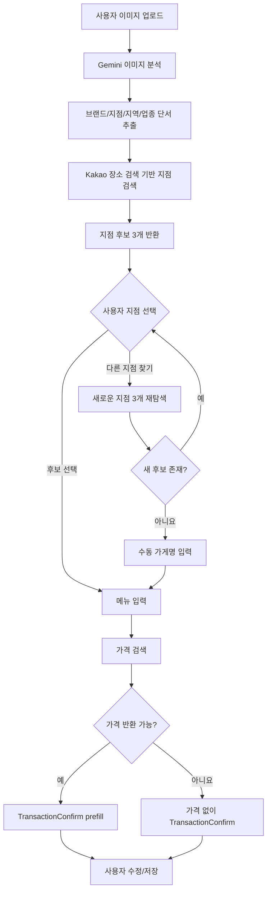

# QuickAdd 이미지-매칭 아키텍처

## 1. 목적

QuickAdd의 이미지-매칭 기능은 사용자가 매장 사진, 간판 사진, 메뉴판 사진을 업로드하면 Gemini가 이미지를 분석해 매장 단서를 추출하고, Kakao 장소 검색 기반으로 실제 지점 후보 3개를 찾아 사용자에게 제안한 뒤, 사용자가 선택한 지점과 메뉴명을 바탕으로 가격을 검색하여 지출 입력을 빠르게 완성하는 기능이다.

이 기능의 목표는 "완전 자동 저장"이 아니라 "가게 선택 + 가격 자동 입력 보조"다. 최종 저장 전에는 기존 지출 확인 화면에서 반드시 사용자가 검토한다.

## 2. 범위와 원칙

- 이미지 분석은 Gemini 멀티모달 분석을 사용한다.
- 지점 후보는 Kakao 장소 검색 기반으로 찾는다.
- 가격은 반드시 근거가 있는 경우만 반환한다.
- 가격 후보 목록은 프론트에 제공하지 않는다.
- 최종 정책은 `가격 반환` 또는 `가격 미반환` 두 가지뿐이다.
- 세 지점 후보가 모두 틀릴 수 있다는 전제를 두고, `다른 지점 찾기` 기반 재탐색 흐름을 둔다.
- 서버의 IP 위치를 사용해 지점을 추정하지 않는다.
- 가능하면 프론트에서 사용자 현재 위치 권한을 받아 검색 bias에 활용한다.

## 3. 전체 사용자 흐름

1. 사용자가 이미지-매칭에 이미지를 업로드한다.
2. 백엔드는 Gemini로 이미지를 분석해 브랜드명, 지점 단서, 주변 지역 단서, 업종 단서를 추출한다.
3. 백엔드는 Kakao 장소 검색 기반으로 지점 후보 3개를 찾는다.
4. 프론트는 후보 3개를 카드 형태로 보여주고 "어느 지점이 맞나요?"를 묻는다.
5. 사용자는 후보 3개 중 하나를 선택한다.
6. 사용자가 `다른 지점 찾기`를 누르면 같은 이미지와 단서를 바탕으로 새로운 지점 후보 3개를 다시 탐색한다.
7. 재탐색 결과가 더 이상 없으면 프론트는 수동 가게명 입력 단계로 전환한다.
8. 사용자는 가게명을 직접 입력한다.
9. 사용자가 지점을 선택하거나 수동으로 가게명을 입력하면 메뉴 입력 부분이 생성된다.
10. 사용자가 메뉴명을 입력한다.
11. 백엔드는 `선택된 지점` 또는 `수동 입력 가게명`을 기준으로 가격을 검색한다.
12. 프론트는 기존 지출 확인 화면에 `가게명`, `메뉴명`, `가격`, `카테고리`, `위치`, `날짜`를 채워 표시한다.
13. 사용자가 수정 후 저장한다.

## 4. 전체 처리 흐름



## 5. 시스템 아키텍처

### 5.1 프론트엔드

기준 파일:

- `frontend/src/components/home/QuickAddPopup.js`
- `frontend/src/components/home/ImageMatching.js`
- `frontend/src/components/home/TransactionConfirm.js`
- `frontend/src/components/common/KakaoLocationPicker.js`

권장 상태 머신:

- `input`
- `imageUploading`
- `branchSelecting`
- `branchRetry`
- `manualStoreInput`
- `menuInput`
- `resolvingPrice`
- `confirm`
- `error`

프론트 책임:

- 이미지 업로드
- 지도 영역에 후보 3개 핀 표시
- 지점 후보 3개 표시
- `다른 지점 찾기` 액션 제공
- 새 지점이 더 없을 때 수동 가게명 입력 UI 제공
- 메뉴 입력 UI 제공
- TransactionConfirm 재사용

### 5.2 백엔드

기준 파일:

- `backend/apps/transactions/views.py`
- `backend/apps/transactions/urls.py`
- `backend/external/ai/client.py`

권장 API:

- `POST /api/transactions/image-match/find-branches/`
- `POST /api/transactions/image-match/find-more-branches/`
- `POST /api/transactions/image-match/resolve-price/`
- `POST /api/transactions/create/`

권장 서비스 분리:

- `ImageStoreClueService`
  - Gemini로 이미지에서 매장 단서 추출
- `KakaoPlacesBranchFinderService`
  - Kakao 장소 검색 기반 지점 후보 검색
- `BranchCandidateScoringService`
  - 지점 후보 점수 계산 및 상위 3개 선택
- `BranchMapPresentationService`
  - 후보 3개를 지도에 표시하기 위한 좌표/뷰포트 정보 생성
- `ManualStoreFallbackService`
  - 수동 입력 가게명을 정규화하고 가격 검색 입력으로 연결
- `MenuPriceResolverService`
  - 선택된 지점과 메뉴명으로 가격 검색
- `PriceScoringService`
  - 가격 반환 여부 판정
- `TransactionPrefillBuilder`
  - 확인 화면에 넣을 구조 생성

## 6. Kakao 장소 검색 기반 지점 후보 추출

### 6.1 왜 Kakao 기반으로 찾는가

이미지 속 간판이나 매장 외관만으로는 정확한 지점명이 나오지 않는 경우가 많다. 하지만 브랜드명, 건물명, 주변 표지판, 역 이름, 업종 정보 같은 단서를 Gemini가 읽어낼 수 있다. 이 단서들을 Kakao 장소 검색에 넣으면 실제 운영 중인 지점 목록으로 연결할 수 있다.

즉, Gemini는 "단서 추출기" 역할을 하고, Kakao 장소 검색은 "실제 지점 정규화" 역할을 한다.

### 6.2 Gemini가 먼저 추출해야 하는 정보

Gemini는 이미지에서 아래 구조를 우선 추출한다.

```json
{
  "brand_name": "스타벅스",
  "possible_branch_tokens": ["강남역", "아이퀘스트", "르피에르"],
  "business_type": "카페",
  "nearby_landmarks": ["강남역", "아이퀘스트타워"],
  "visible_store_text": "STARBUCKS COFFEE",
  "confidence": 0.0
}
```

핵심은 정확한 지점명을 한 번에 맞히는 것이 아니라, 검색 가능한 단서를 구조화하는 것이다.

### 6.3 Kakao 기반 검색 방식

지점 검색의 기본 경로는 `Kakao Places keywordSearch`다.

이유:

- 입력이 텍스트 단서 중심이다.
- 브랜드명 + 지역명 + 건물명 조합으로 검색하기 좋다.
- 특정 지점명을 모를 때도 검색 확장이 쉽다.

검색 쿼리 예시:

- `스타벅스 강남역`
- `스타벅스 아이퀘스트`
- `스타벅스 르피에르`
- `스타벅스 강남역 아이퀘스트타워`

추천 검색 전략:

1. Gemini가 추출한 `brand_name`으로 1차 검색
2. `possible_branch_tokens`를 조합해 2차 검색
3. `nearby_landmarks`를 조합해 3차 검색
4. 결과를 병합한 뒤 중복 Kakao 장소 ID 제거

### 6.4 위치 bias 사용 방식

가능하면 프론트에서 사용자 현재 위치를 받아 요청에 포함한다.

예:

```json
{
  "user_location": {
    "lat": 37.498,
    "lng": 127.028
  }
}
```

위치 정보가 있으면 Kakao 검색 결과를 거리 기준으로 재정렬하거나, 현재 위치 중심으로 후보 점수에 가중치를 준다. 이렇게 하면 동일 브랜드 지점이 많은 경우 현재 위치 근처의 지점이 더 위로 오게 된다.

중요:

- 서버 IP 위치는 사용하지 않는다.
- 서버가 클라우드에 떠 있으면 실제 사용자와 전혀 다른 지역일 수 있다.
- 따라서 위치 가중치는 `사용자 현재 위치` 또는 `이미지에서 읽힌 지역 단서`만 사용한다.

### 6.5 지도 표시 방식

지점 후보 3개를 보여줄 때는 Kakao 지도를 렌더링하고, 후보 3개의 좌표를 핀으로 표시한다.

구현 방식:

1. 백엔드가 후보 3개 각각의 `x`, `y` 좌표를 프론트에 내려준다.
2. 프론트는 `window.kakao.maps.Map`으로 지도를 생성한다.
3. 후보 3개에 대해 `kakao.maps.Marker`를 각각 만든다.
4. `kakao.maps.LatLngBounds`에 3개 좌표를 모두 넣는다.
5. `map.setBounds(bounds)`를 호출해 세 핀이 모두 보이게 한다.
6. 사용자가 카드 또는 핀을 누르면 선택된 지점을 강조한다.

즉, 지도는 "정답을 찾는 도구"라기보다 "후보 3개를 사용자가 빠르게 구분하도록 돕는 보조 UI"다.

### 6.6 후보 3개를 지도에 어떻게 보여줄 것인가

지도에서 각 후보는 핀으로 표시하고, 리스트 카드와 동기화한다.

권장 표시 방식:

- 핀 3개는 기본 스타일로 모두 표시
- 선택된 후보의 핀만 색상 또는 크기를 다르게 표시
- 지도 하단에는 후보 카드 3개를 함께 표시
- 카드 선택과 핀 선택은 같은 상태를 공유
- 지도만 보고 선택하기 어렵기 때문에 카드 정보와 병행해야 함

프론트 카드에 필요한 최소 정보:

- 지점명
- 주소
- 좌표
- confidence

즉, 후보 선택 UI는 "지도 + 후보 카드 3개"의 조합으로 보는 것이 적절하다.

### 6.7 지점 후보 점수 계산

지점 후보는 내부적으로 점수화한 뒤 상위 3개만 반환한다.

```text
branch_score
= brand_match (0~40)
+ branch_token_match (0~20)
+ area_match (0~15)
+ landmark_match (0~10)
+ type_match (0~10)
+ distance_bonus (0~5)
```

#### brand_match

- 브랜드 exact 일치: 40
- 유사 브랜드명: 20~35
- 불일치: 0

#### branch_token_match

- Gemini가 추출한 지점 단어와 정확히 일치: 15~20
- 일부만 일치: 5~14
- 없음: 0

#### area_match

- 지역/역명/건물명이 강하게 일치: 10~15
- 일부만 일치: 4~9
- 없음: 0

#### landmark_match

- 주변 랜드마크 단서와 잘 맞음: 5~10
- 없음: 0

#### type_match

- Gemini가 본 업종과 Kakao 카테고리가 맞음: 5~10
- 불명확: 0~4

#### distance_bonus

- 사용자 현재 위치와 가까움: 1~5
- 위치 정보 없음: 0

### 6.8 왜 3개만 보여주는가

- 모바일 UI에서 한 번에 비교하기 적당하다.
- 5개 이상부터는 사용자가 읽기 피로를 느낀다.
- 1개만 주면 오탐에 취약하고, 2개는 선택 폭이 좁다.
- 3개면 "AI 추천"과 "사용자 최종 판단"의 균형이 좋다.

반환 예시:

```json
{
  "candidates": [
    {
      "place_id": "abc1",
      "name": "스타벅스 강남역점",
      "address": "서울 강남구 ...",
      "lat": 37.49,
      "lng": 127.03,
      "place_url": "https://place.map.kakao.com/...",
      "confidence": 0.91
    },
    {
      "place_id": "abc2",
      "name": "스타벅스 강남아이퀘스트점",
      "address": "서울 강남구 ...",
      "lat": 37.50,
      "lng": 127.02,
      "place_url": "https://place.map.kakao.com/...",
      "confidence": 0.83
    },
    {
      "place_id": "abc3",
      "name": "스타벅스 강남르피에르점",
      "address": "서울 강남구 ...",
      "lat": 37.49,
      "lng": 127.02,
      "place_url": "https://place.map.kakao.com/...",
      "confidence": 0.79
    }
  ]
}
```

## 7. 다른 지점 찾기 처리

### 7.1 왜 별도 흐름이 필요한가

브랜드는 맞아도 지점 단서가 약할 수 있다. 특히 다음 경우에는 상위 3개가 모두 틀릴 가능성이 있다.

- 간판이 멀리 찍혀 있음
- 지점 고유 단서가 거의 없음
- 같은 브랜드 지점이 반경 1km 내에 매우 많음
- 사용자 현재 위치 권한이 없음
- 이미지가 실내 사진이라 외부 지점 단서가 약함

따라서 `다른 지점 찾기`는 예외가 아니라 정상 플로우로 취급해야 한다.

### 7.2 권장 UX

지점 후보 3개 아래에는 버튼을 하나만 둔다.

- `다른 지점 찾기`

화면을 벗어나는 액션은 별도 하단 버튼 대신 상단 `X`로 처리한다.

이렇게 하면 사용자가 처음 보는 선택 UI가 단순해지고, 액션 의미도 명확해진다.

### 7.3 지점 재탐색 방식

`다른 지점 찾기`를 누르면 사용자가 추가 입력을 하지 않아도, 같은 이미지와 같은 분석 단서를 기반으로 백엔드가 자동으로 새로운 지점 후보 3개를 다시 찾는다.

즉, 이 기능의 재탐색은 `수동 검색`이 아니라 `자동 재탐색`이다.

처리 방식:

1. 첫 번째 `find-branches` 호출 시 백엔드는 이미지 분석 결과와 검색 단서를 묶은 `search_context_id`를 만든다.
2. 프론트는 현재까지 사용자에게 보여준 `place_id` 3개를 기억한다.
3. 사용자가 `다른 지점 찾기`를 누르면 `search_context_id`와 `excluded_place_ids`를 백엔드에 보낸다.
4. 백엔드는 같은 브랜드/지역/랜드마크 단서를 재사용하되, 이미 보여준 `place_id`를 제외한 상태로 Kakao 장소 검색을 다시 수행한다.
5. 그 결과 중 아직 노출되지 않은 상위 3개를 새 후보 세트로 반환한다.
6. 사용자가 그 중 하나를 선택하면 정상 흐름으로 복귀한다.

이 구조의 장점은 사용자가 입력 부담 없이 "다음 후보 세트"만 계속 받아볼 수 있다는 점이다.

### 7.4 재탐색 시 검색 전략을 어떻게 바꿀 것인가

재탐색은 단순히 같은 요청을 다시 보내는 것이 아니라, "초기 탐색보다 더 넓은 범위와 완화된 조건"으로 다시 찾는 과정이어야 한다.

예:

- 1차 탐색:
  - 브랜드 exact 매칭 우선
  - 지점 토큰 강한 일치 우선
  - 사용자 위치 bias 강하게 적용
- 2차 탐색:
  - landmark/지역 단서 가중치 확대
  - 지점 토큰 부분 일치 허용
  - 위치 bias 반경 확대
- 3차 탐색:
  - 브랜드 + 지역 중심으로 더 넓게 탐색
  - 업종/랜드마크 매칭으로 재정렬

핵심 규칙:

- 이미 보여준 `place_id`는 다시 보여주지 않는다.
- 재탐색할 때마다 후보 세트가 실제로 달라져야 한다.
- 동일 후보가 반복되면 사용자 경험이 급격히 나빠진다.
- 재탐색은 2~3회 정도로 제한하는 것이 적절하다.
- 2차 재탐색에서도 새 후보가 충분히 없으면, 남은 후보 수가 3개 미만이어도 그대로 반환한다.
- 더 이상 새로운 후보가 없으면 프론트는 `manualStoreInput` 상태로 전환한다.

### 7.5 재탐색에서도 못 찾을 경우

재탐색을 여러 번 수행해도 더 이상 새로운 지점 후보가 없을 수 있다.

이 경우에는 후보 선택 화면을 끝내고, 수동 가게명 입력 단계로 전환한다.

권장 흐름:

1. 자동 재탐색으로 가능한 후보를 모두 소진할 때까지 탐색한다.
2. 새로운 후보가 더 이상 없으면 `manualStoreInput` 상태로 전환한다.
3. 사용자는 가게명을 직접 입력한다.
4. 이후에는 `수동 입력 가게명 + 메뉴명` 기준으로 가격 검색을 진행한다.

즉, 이 구조에서는 "자동 재탐색을 충분히 시도한 뒤, 마지막 fallback으로만 수동 입력을 받는다"는 원칙을 유지한다.

## 8. 메뉴 가격 검색 아키텍처

### 8.1 입력값

가격 검색은 사용자가 선택한 지점이 확정되었거나, 자동 재탐색 실패 후 가게명을 수동 입력한 뒤에 수행한다.

입력 예시:

```json
{
  "selected_place": {
    "place_id": "abc1",
    "name": "스타벅스 강남역점",
    "address": "서울 강남구 ...",
    "place_url": "https://place.map.kakao.com/...",
    "lat": 37.49,
    "lng": 127.03
  },
  "menu_name": "아이스 아메리카노",
  "selected_date": "2026-03-31"
}
```

또는 수동 입력 fallback:

```json
{
  "manual_store_name": "스타벅스 강남역점",
  "menu_name": "아이스 아메리카노",
  "selected_date": "2026-03-31"
}
```

### 8.2 검색 전략

가격 검색은 `선택된 지점 + 메뉴명` 또는 `수동 입력 가게명 + 메뉴명` 기준으로 수행한다.

추천 검색 순서:

1. 지점의 공식 웹사이트가 있으면 그 사이트를 우선
2. 브랜드 공식 메뉴 페이지
3. 공식 주문/예약 페이지
4. 배달/주문 플랫폼 메뉴 페이지
5. 포털 메뉴 정보

Gemini는 검색 결과를 읽고 가격을 구조화하지만, 검색 근거 없이 가격을 만들면 안 된다.

### 8.3 가격 점수 계산

가격 후보는 내부적으로 점수화하되, 프론트에는 후보 목록을 주지 않는다.

```text
candidate_score
= menu_similarity (0~40)
+ store_match (0~20)
+ evidence_quality (0~20)
+ text_quality (0~10)
+ price_sanity (0~10)
```

출처 상한선:

- `official_menu_page`: 90
- `official_order_page`: 90
- `delivery_menu_page`: 85
- `portal_menu`: 70
- `blog/review/community`: 55

최종 후보 점수:

```text
final_candidate_score = min(candidate_score, source_cap)
```

같은 가격끼리 묶은 뒤 최종 점수를 계산한다.

```text
price_score
= best_candidate_score
+ agreement_bonus (0~10)
+ source_diversity_bonus (0~5)
- conflict_penalty (0~20)
```

### 8.4 반환 기준

- `price_score >= 75`: 가격 반환
- `price_score < 75`: 가격 미반환

즉, 애매한 가격은 아예 내려주지 않는다. 사용자는 어차피 확인 화면에서 직접 금액을 넣을 수 있으므로, 잘못된 가격을 주는 것보다 빈 값이 낫다.

### 8.5 응답 정책

반환 예시:

```json
{
  "status": "matched",
  "prefill": {
    "store": "스타벅스 강남역점",
    "item": "아이스 아메리카노",
    "amount": 4500,
    "category": "식비",
    "address": "서울 강남구 ...",
    "date": "2026-03-31"
  },
  "match_meta": {
    "confidence": 0.84,
    "source_type": "official_menu_page",
    "source_url": "https://...",
    "reason": "공식 메뉴 페이지에서 메뉴명과 가격이 확인됨"
  }
}
```

미반환 예시:

```json
{
  "status": "not_found",
  "prefill": {
    "store": "스타벅스 강남역점",
    "item": "아이스 아메리카노",
    "amount": null,
    "category": "식비",
    "address": "서울 강남구 ...",
    "date": "2026-03-31"
  },
  "match_meta": {
    "confidence": 0.42,
    "source_type": "unknown",
    "source_url": "",
    "reason": "신뢰할 수 있는 가격 근거를 찾지 못함"
  }
}
```

## 9. Gemini 프롬프트에 반드시 들어가야 할 규칙

### 9.1 지점 후보 추출용 규칙

- 이미지에서 보이는 브랜드명, 지점 단서, 지역명, 건물명, 업종을 구조화할 것
- 보이지 않는 정보를 상상해서 만들지 말 것
- 지점명을 하나로 단정하지 말고 검색 가능한 단서 중심으로 반환할 것
- confidence를 함께 반환할 것

### 9.2 가격 검색용 규칙

- 검색 근거 없이 가격을 만들지 말 것
- 모델 기억이나 일반 상식으로 가격을 추정하지 말 것
- 공식 메뉴/주문 페이지를 최우선으로 볼 것
- 오래된 비공식 글은 현재 가격 근거로 쓰지 말 것
- 메뉴명 exact match를 우선할 것
- 아이스/핫, 세트/단품, 사이즈 차이를 구분할 것
- 여러 가격이 충돌하면 더 신뢰도 높은 출처와 더 최신인 출처를 우선할 것
- 그래도 애매하면 가격을 반환하지 말 것
- 반드시 JSON만 반환할 것

## 10. 권장 API 스펙

### 10.1 `find-branches`

Request:

```json
{
  "imageData": "base64...",
  "format": "jpg",
  "user_location": {
    "lat": 37.498,
    "lng": 127.028
  }
}
```

Response:

```json
{
  "search_context_id": "im_ctx_123",
  "clues": {
    "brand_name": "스타벅스",
    "possible_branch_tokens": ["강남역", "아이퀘스트", "르피에르"],
    "business_type": "카페"
  },
  "candidates": []
}
```

### 10.2 `find-more-branches`

Request:

```json
{
  "search_context_id": "im_ctx_123",
  "excluded_place_ids": ["abc1", "abc2", "abc3"],
  "retry_index": 1
}
```

Response:

```json
{
  "has_more_candidates": false,
  "candidates": []
}
```

### 10.3 `resolve-price`

Request:

```json
{
  "place_id": "abc1",
  "place_name": "스타벅스 강남역점",
  "address": "서울 강남구 ...",
  "menu_name": "아이스 아메리카노",
  "selected_date": "2026-03-31"
}
```

Response:

```json
{
  "status": "matched | not_found",
  "prefill": {},
  "match_meta": {}
}
```

## 11. 구현 우선순위

1. 이미지 업로드 UI
2. Gemini 기반 매장 단서 추출
3. Kakao 장소 검색 기반 지점 후보 3개 찾기
4. 후보 선택 UI
5. `다른 지점 찾기` 재탐색 흐름
6. 새 후보 고갈 시 수동 가게명 입력 fallback
7. 메뉴명 입력 UI
8. 가격 검색 API
9. TransactionConfirm 연동

## 12. 최종 결론

이 기능의 핵심은 "이미지에서 바로 정답 지점을 맞히는 것"이 아니라, "Gemini가 읽은 단서를 Kakao 장소 데이터에 연결하고, 사용자가 최종 지점을 선택하게 만드는 것"이다.

가장 안정적인 구조는 다음과 같다.

- Gemini는 이미지에서 매장 단서를 뽑는다.
- Kakao 장소 검색으로 실제 지점 후보 3개를 만든다.
- 후보 3개는 Kakao 지도에 핀으로 함께 표시한다.
- 사용자가 정확한 지점을 선택한다.
- 맞는 지점이 없으면 `다른 지점 찾기`로 새로운 후보 3개를 다시 받는다.
- 더 이상 새로운 후보가 없으면 수동 가게명 입력으로 전환한다.
- 선택된 지점 또는 수동 입력 가게명과 메뉴명으로 가격을 검색한다.
- 가격이 충분히 확실할 때만 반환한다.
- 최종 저장은 사용자가 확인한다.
